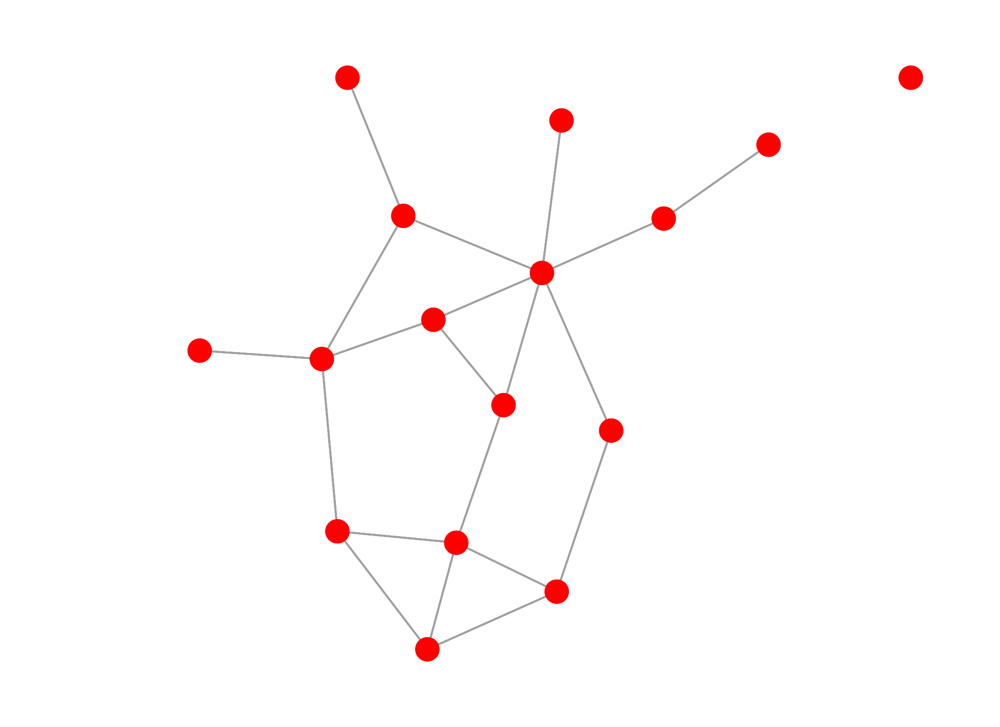
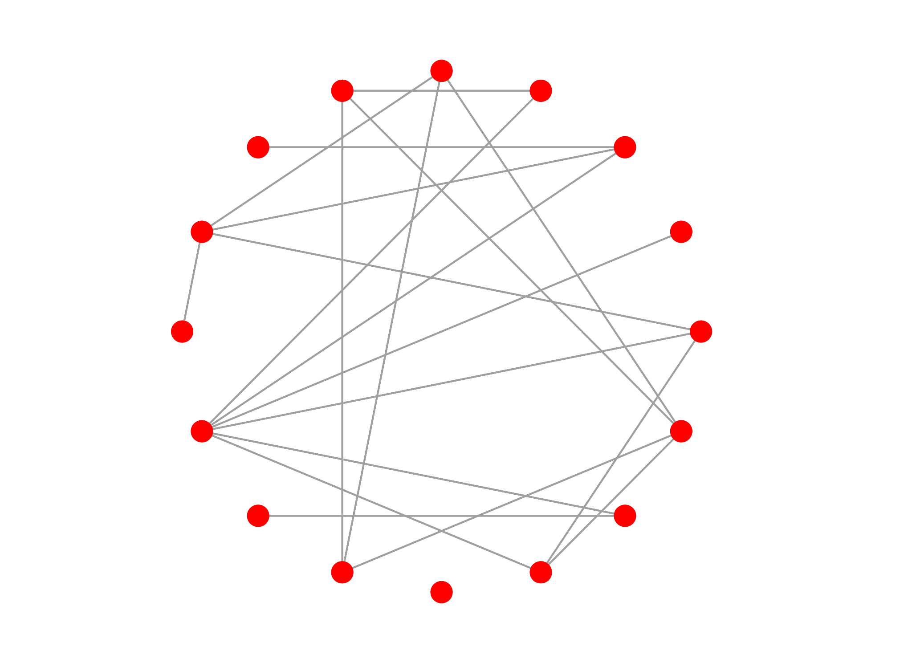
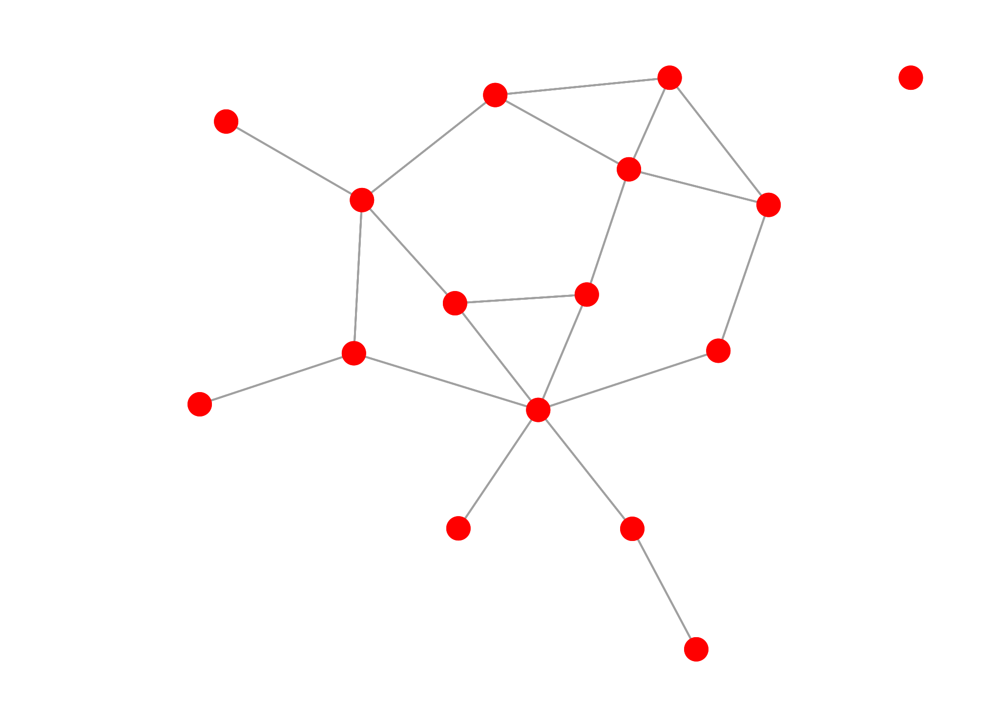
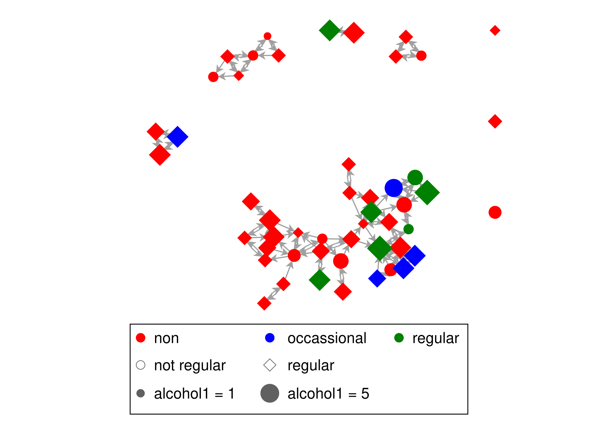
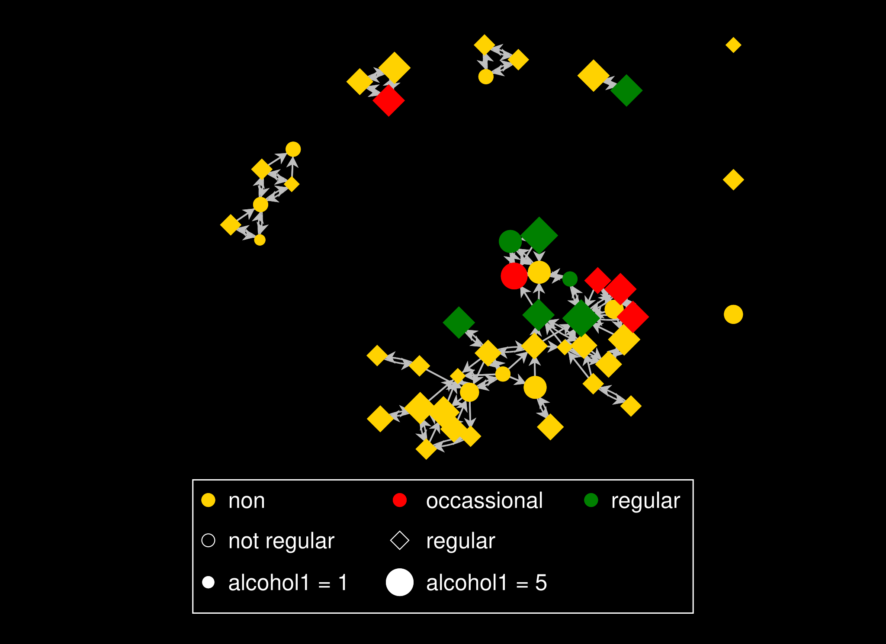
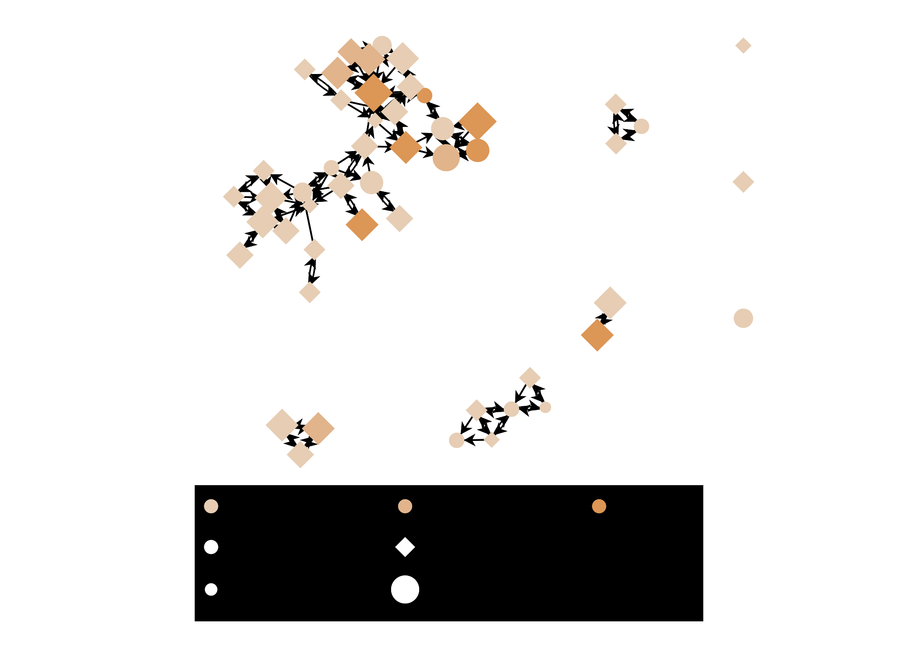
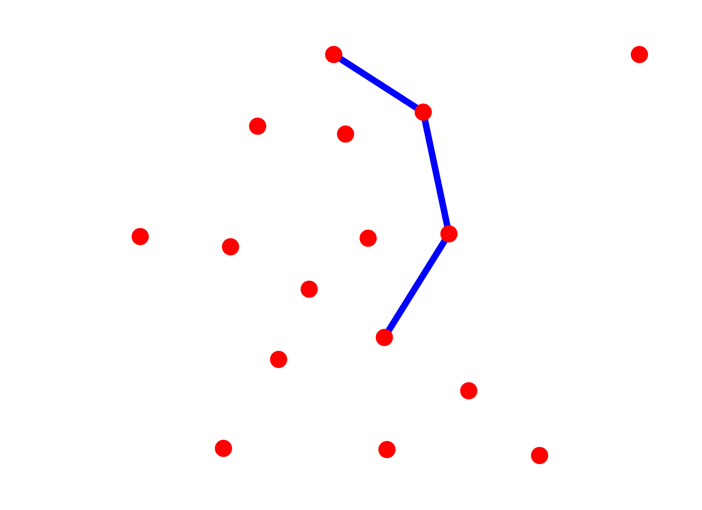

# Visualization

`nwplot` draws a network directly from the current or a named network object, with no manual
edge-list-to-coordinates plumbing required. This tutorial covers styling a static plot, exporting
publication-quality vector graphics, and building interactive and animated views of a network.

## A basic plot

With no styling options, `nwplot` just shows the structure:

```stata
. nwwebuse florentine, nwclear

. nwplot flomarriage, scheme(s1network) export("plot_basic.svg") replace
Calculating node coordinates...
Plotting network...
Exporting graph to plot_basic.svg...
file plot_basic.svg saved as SVG format
```



## Layouts

`layout()` controls how nodes are positioned. `circle` places every node on a ring; `kk`
(Kamada-Kawai) is a force-directed layout that pulls connected nodes closer together:

```stata
. nwplot flomarriage, layout(circle) scheme(s1network) export("plot_circle.svg") replace
. nwplot flomarriage, layout(kk) scheme(s1network) export("plot_kk.svg") replace
```

| `layout(circle)` | `layout(kk)` |
|---|---|
|  |  |

## Styling by attribute

`color()`, `symbol()`, and `size()` each take a variable and map its values onto the plot:

```stata
. nwwebuse glasgow, nwclear

. nwplot glasgow1, color(smoke1) symbol(sport1) size(alcohol1) scheme(s1network) export("plot_styled.svg") replace
Calculating node coordinates...
Generating splines...
Plotting network...
Exporting graph to plot_styled.svg...
file plot_styled.svg saved as SVG format
```



## Schemes

nwcommands ships three schemes purpose-built for network plots — `s1network` (used above),
`s2network`, and `s3network` — each giving node fill and edge line colors that are visually
distinct by default:

```stata
. nwplot glasgow1, color(smoke1) symbol(sport1) size(alcohol1) scheme(s2network) export("plot_scheme2.svg") replace
. nwplot glasgow1, color(smoke1) symbol(sport1) size(alcohol1) scheme(s3network) export("plot_scheme3.svg") replace
```

| `scheme(s2network)` | `scheme(s3network)` |
|---|---|
|  |  |

## Highlighting a path

Combining `nwpath` with `edgecolor()` highlights a specific route through the network — here,
the shortest path between two Medici-era Florentine families. `nwpath`'s `generate()` creates a
new network per shortest path found (`sp_1` here - a pair with multiple shortest paths would
also get `sp_2`, `sp_3`, ...), and that new network can be passed straight to `edgecolor()`:

```stata
. nwwebuse florentine, nwclear

. nwpath flomarriage, ego(medici) alter(peruzzi) generate(sp)

----------------------------------------
  Network: flomarriage
----------------------------------------
    Ego                  : medici
    Alter                : peruzzi
    Shortest path length : 3
----------------------------------------
  Path 1: medici <=> barbadori <=> castellani <=> peruzzi
  Path 2: medici <=> ridolfi <=> strozzi <=> peruzzi

. nwplot flomarriage, edgecolor(sp_1, legendoff) scheme(s1network) export("plot_path.svg") replace
```



Don't reach for `edgesize()` here to make the path stand out further - it scales edge width
*proportionally* to the variable's own value, so a 0/1 indicator like `sp_1` makes every
non-path edge exactly zero-width (invisible), leaving only the path on the plot. `edgecolor()`
alone is the right tool for a discrete highlight/no-highlight distinction like this.

## Interactive plots

`interactive` opens the same plot in a browser-based, editable view: drag nodes to reposition
them, and click a color or shape swatch in the legend to recolor every node sharing that value.
It's the same view embedded live below — try it:

```stata
. nwwebuse glasgow, nwclear

. nwplot glasgow1, color(smoke1) symbol(sport1) scheme(s1network) interactive noopen
Calculating node coordinates...
Generating splines...
Preparing interactive view...
Plotting network...
```

{: .note }
Drag any node below to reposition it. Click a legend swatch to change the color assigned to that
whole group.

<iframe src="interactive_plot.html" width="100%" height="600" style="border:1px solid #d0d7de; border-radius:6px;" loading="lazy"></iframe>

Two buttons in that view save your edits as CSV files — feed them back into a later `nwplot` call
with `importcoords()`/`edgeimport()` to reuse a hand-arranged layout. See
[nwplot](../../reference/nwplot) for the full round trip.

## Movies

`nwmovie` turns a sequence of waves of the same network into a single, self-contained,
browser-based timeline player — drag the slider and watch nodes and ties change wave to wave:

```stata
. nwmovie glasgow1 glasgow2 glasgow3, noopen fname(friendship_movie)
Resolving network glasgow1 (1/3)...
Resolving network glasgow2 (2/3)...
Resolving network glasgow3 (3/3)...
Wrote friendship_movie.html
```

{: .note }
Drag the timeline slider below to move between the three waves of the Glasgow friendship network.

<iframe src="friendship_movie.html" width="100%" height="600" style="border:1px solid #d0d7de; border-radius:6px;" loading="lazy"></iframe>
