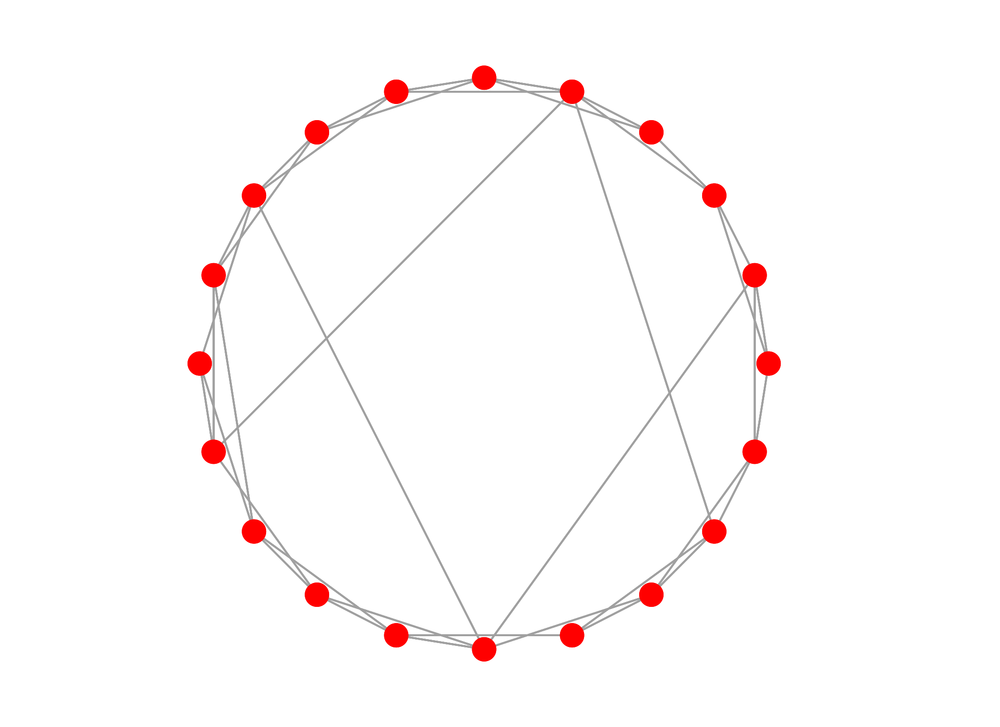
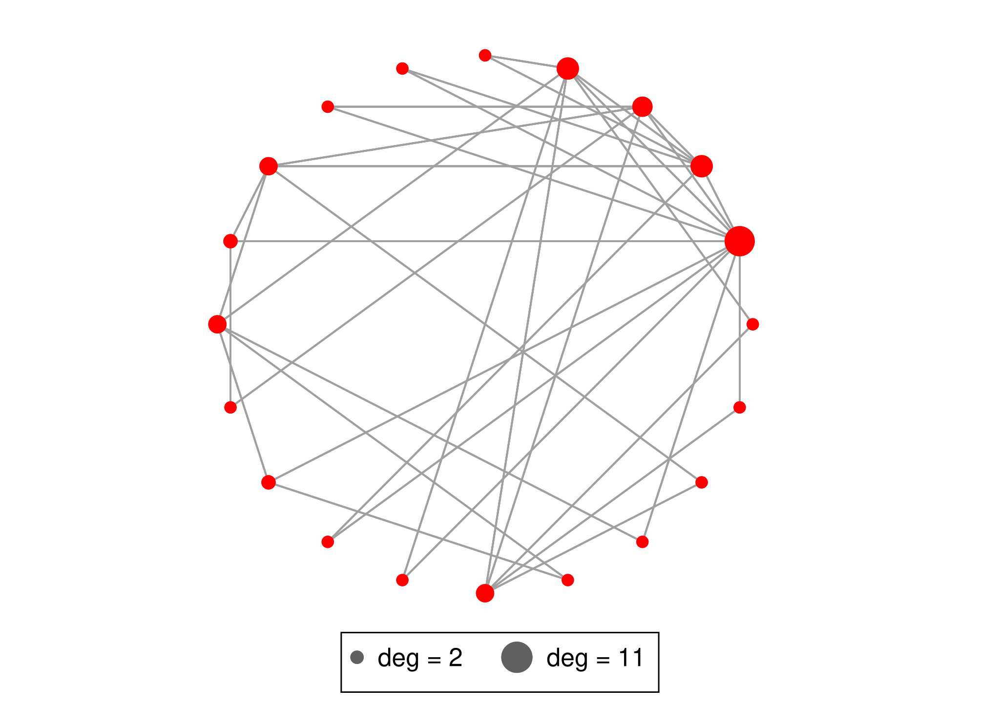
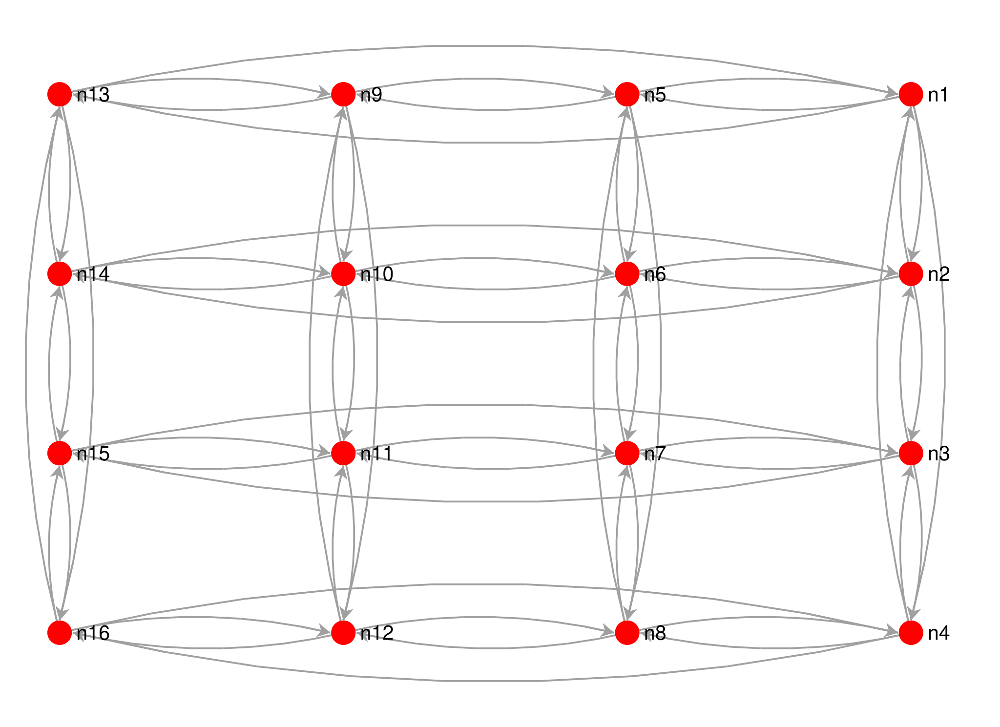

# Generating Networks

Sometimes you don't want real data at all — you want a network with known, controllable
properties, to teach a concept, test a method, or run a simulation against. nwcommands ships
four generators, each producing a different, well-studied kind of structure.

## Random networks (Erdős–Rényi)

`nwrandom` gives every potential tie the same, independent probability of existing:

```stata
. nwclear

. nwrandom 15, prob(.2) undirected

. nwsummarize
--------------------------------------------------
   Network name:  random
   Network id:  1
   Directed: false
   Valued: false
   Two-mode: false
   Nodes: 15
   Selfloop: false
   Edges: 22
   Minimum value:  0
   Maximum value:  1
   Density:  .21
   Temporal: false
```

`prob()` leaves the exact tie count to chance — `.21` density here, not exactly `.2`. Use
`density()` instead to fix the tie count exactly:

```stata
. nwrandom 15, density(.2) undirected name(randdens)

. nwsummarize randdens
--------------------------------------------------
   Network name:  randdens
   Network id:  2
   Directed: false
   Valued: false
   Two-mode: false
   Nodes: 15
   Selfloop: false
   Edges: 21
   Minimum value:  0
   Maximum value:  1
   Density:  .2
   Temporal: false
```

`weights()` assigns a value to each placed tie, independent of how the tie itself was placed —
here, weight `1` never occurs (probability `0.0`), weight `2` occurs about 30% of the time, and
weight `3` about 70%:

```stata
. nwrandom 15, prob(.2) undirected weights(0.0, 0.3, 0.7) name(randval)

. nwsummarize randval
--------------------------------------------------
   Network name:  randval
   Network id:  3
   Directed: false
   Valued: true
   Two-mode: false
   Nodes: 15
   Selfloop: false
   Edges: 19
   Minimum value:  0
   Maximum value:  3
   Density:  .181
   Temporal: false
```

## Small-world networks (Watts–Strogatz)

`nwsmall` starts from a *ring lattice* — every node tied to its `k` nearest neighbors on each
side — then rewires a fraction of those ties at random. The result keeps the ring's local
clustering while a few long-range "shortcuts" dramatically shrink the distance between distant
nodes — the classic "small-world" effect:

```stata
. nwsmall 20, k(2) prob(.1) undirected

. nwsummarize
--------------------------------------------------
   Network name:  small
   Network id:  4
   Directed: false
   Valued: false
   Two-mode: false
   Nodes: 20
   Selfloop: false
   Edges: 40
   Minimum value:  0
   Maximum value:  1
   Density:  .211
   Temporal: false

. nwplot, layout(circle) scheme(s1network) export("plot_smallworld.svg") replace
```



Laid out on a circle, most ties stay short (connecting near-neighbors on the ring), with a
handful of longer chords cutting across — those are the rewired shortcuts.

## Preferential attachment (Barabási–Albert)

`nwpref` grows a network one node at a time: each new node is more likely to connect to
already-well-connected nodes than to obscure ones. This "rich get richer" dynamic produces a
characteristic *hub* structure — a few nodes accumulate far more ties than the rest:

```stata
. nwpref 20, undirected

. nwsummarize
--------------------------------------------------
   Network name:  pref
   Network id:  5
   Directed: false
   Valued: false
   Two-mode: false
   Nodes: 20
   Selfloop: false
   Edges: 37
   Minimum value:  0
   Maximum value:  1
   Density:  .195
   Temporal: false

. nwdegree, generate(deg)
----------------------------------------
  Network name: pref
----------------------------------------
    Degree distribution

        deg |      Freq.     Percent        Cum.
------------+-----------------------------------
          2 |         11       55.00       55.00
          3 |          2       10.00       65.00
          5 |          3       15.00       80.00
          6 |          1        5.00       85.00
          7 |          2       10.00       95.00
         11 |          1        5.00      100.00
------------+-----------------------------------
      Total |         20      100.00

   Degree centralization:: .427

. sort deg _nwnode

. list _nwnode deg in -5/-1

     +---------------+
     | _nwnode   deg |
     |---------------|
 16. |      n8     5 |
 17. |      n3     6 |
 18. |      n2     7 |
 19. |      n4     7 |
 20. |      n1    11 |
     +---------------+
```

Over half the nodes have only degree 2, while `n1` — one of the earliest nodes, and so one of the
first eligible targets for every later arrival — ends up with degree 11. Sizing nodes by degree
makes the hub visible directly:

```stata
. nwplot, layout(circle) scheme(s1network) size(deg) export("plot_prefattach.svg") replace
```



## Lattice networks

`nwlattice` generates a plain structured grid — no randomness at all — useful as a baseline or
for teaching (e.g. contrasting a regular structure against the random/small-world/preferential
ones above). `xwrap`/`ywrap` wrap the grid's edges around so every node has exactly 4 neighbors:

```stata
. nwlattice 4 4, xwrap ywrap

. nwsummarize
--------------------------------------------------
   Network name:  lattice
   Network id:  6
   Directed: true
   Valued: false
   Two-mode: false
   Nodes: 16
   Selfloop: false
   Arcs: 64
   Minimum value:  0
   Maximum value:  1
   Density:  .267
   Temporal: false

. nwplot, layout(grid) label(_nwnode) scheme(s1network) export("plot_lattice.svg") replace
```


